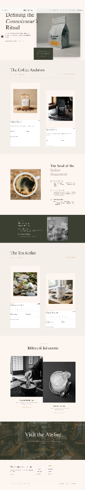

# Atelier E-commerce

A premium, state-of-the-art e-commerce experience built with Next.js, featuring a sophisticated design aesthetic and immersive user interactions.

## 🎨 Design Vision

Atelier is designed to evoke the feeling of a high-end luxury boutique. The interface uses a curated, harmonious color palette, elegant typography, and smooth, scroll-based animations to create a truly premium shopping experience.



## ✨ Key Features

- **Immersive Hero Section**: A high-impact entrance with refined typography and visuals.
- **Dynamic Scroll Animations**: Theme transitions that respond to user interaction (powered by Framer Motion).
- **Curated Collections**: Elegant presentation of "The Coffee Archives", "The Tea Atelier", and "Ethereal Infusions".
- **Refined Styling**: Custom CSS Modules with a focus on micro-animations and glassmorphism.
- **Responsive Design**: Flawless experience across all device sizes.

## 🛠️ Tech Stack

- **Framework**: [Next.js](https://nextjs.org/) (App Router)
- **Styling**: Vanilla CSS Modules
- **Animations**: [Framer Motion](https://www.framer.com/motion/)
- **Icons**: Lucide React
- **Fonts**: Geist Sans & Mono

## 🚀 Getting Started

First, install the dependencies:

```bash
npm install
```

Then, run the development server:

```bash
npm run dev
```

Open [http://localhost:3000](http://localhost:3000) with your browser to see the result.

## 📦 Project Structure

- `src/app`: Next.js App Router and global styles.
- `src/components`: Reusable UI components (Hero, FeaturedProducts, Heritage, etc.).
- `public/images`: Project assets and visuals.

---

Built with ❤️ for a premium e-commerce experience.
